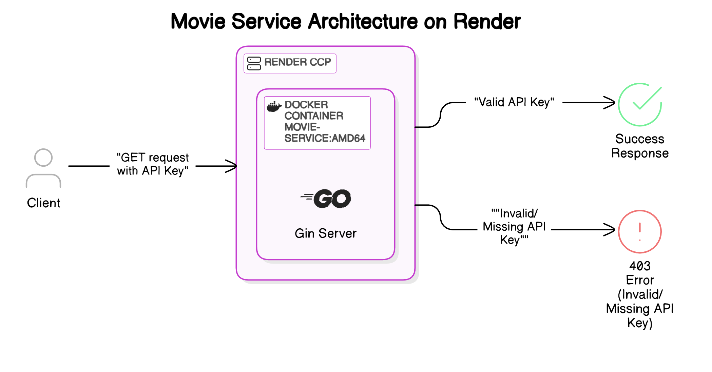

# Skyfox Helper

A collection of containerized microservices built with Go, designed to provide movie information and payment processing capabilities.

## Project Overview

Skyfox Helper is a repository containing two independent, containerized microservices:

1. **Movie Service**: Provides movie information via a RESTful API
2. **Payment Service**: Processes payment transactions with comprehensive validation

Both services are built with Go, follow modern microservice architecture principles, and are designed to be deployed using containers.

## Services

### Movie Service

The Movie Service provides access to a database of movies with detailed information including titles, ratings, plot summaries, and other metadata.



**Key Features:**
- RESTful API for accessing movie data
- Get all movies or specific movie details by ID
- API key authentication
- Health check endpoint
- Containerized for easy deployment

[View Movie Service Documentation](./movie_service/README.md)

### Payment Service

The Payment Service offers a robust payment processing gateway with comprehensive validation and secure transaction handling.

**Key Features:**
- Process payment transactions
- Card validation (Luhn check, expiry validation)
- API key authentication
- Request and transaction tracking
- Built using Test-Driven Development
- Containerized for easy deployment

[View Payment Service Documentation](./payment_service/README.md)

## Getting Started

### Prerequisites

- Docker
- Docker Compose (optional, for running both services together)
- Go 1.21+ (for local development)

### Running with Docker

#### Movie Service

```bash
docker run -p 4567:4567 -e API_KEY=your_api_key iamsuteerth/movie-service:amd64
```

#### Payment Service

```bash
docker run -p 8082:8082 -e API_KEY=your_api_key iamsuteerth/payment-service:amd64
```

### Running with Docker Compose

Create a `docker-compose.yml` file:

```yaml
version: '3'

services:
  movie-service:
    image: iamsuteerth/movie-service:amd64
    ports:
      - "4567:4567"
    environment:
      - API_KEY=your_api_key
      - LOG_LEVEL=info

  payment-service:
    image: iamsuteerth/payment-service:amd64
    ports:
      - "8082:8082"
    environment:
      - API_KEY=your_api_key
      - LOG_LEVEL=info
```

Run with:

```bash
docker-compose up
```

## Development

### Project Structure

```
.
├── movie_service/             # Movie information service
│   ├── data/                  # Movie database
│   ├── internal/              # Internal packages
│   ├── server/                # Server implementation
│   ├── Dockerfile             # Container configuration
│   └── README.md              # Service documentation
│
└── payment_service/           # Payment processing service
    ├── processor/             # Payment processing logic
    ├── types/                 # Data models and types
    ├── validator/             # Input validation
    ├── Dockerfile             # Container configuration
    └── README.md              # Service documentation
```

### Local Development

1. Clone the repository
   ```
   git clone https://github.com/yourusername/skyfox-helper.git
   cd skyfox-helper
   ```

2. Navigate to the service directory you want to work on
   ```
   cd movie_service
   # or
   cd payment_service
   ```

3. Run the service locally
   ```
   go run main.go
   # or for movie service
   go run server/main.go
   ```

## Security

Both services implement API key authentication. Set the `API_KEY` environment variable and include it in the `x-api-key` header when making requests.
