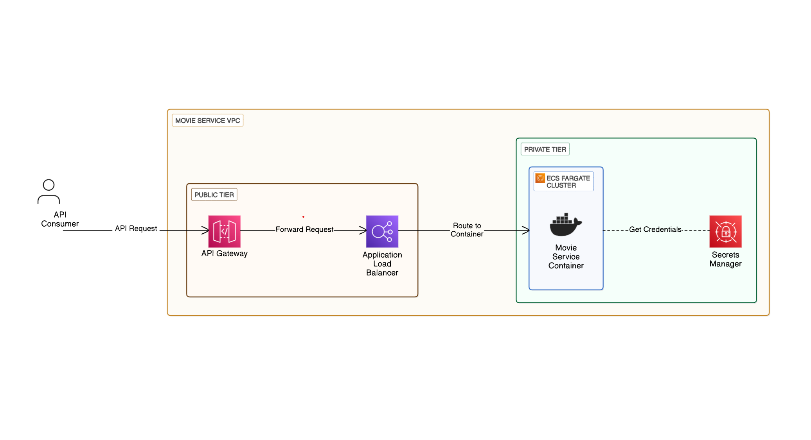

# Movie API Service 

Movie API service leveraging AWS serverless and container ecosystem. Ruby Sinatra application containerized.

[Docker Image Here](https://hub.docker.com/repository/docker/iamsuteerth/movie-service)

## 🌟 Features
- REST API with authentication
- Auto-scaling container infrastructure
- Secure AWS Secrets Manager integration
- Regional API Gateway deployment
- Private networking configuration

## 📚 API Documentation

### `GET /movies`
**Authentication**: API Key required<br>
**Action**: List of all movies<br>
**Error Handling**:
- `200 OK`: Movies found
- `404 Not Found`: JSON error message
- `403 Forbidden`: Invalid API key  

**Example Response**:  
```
[
    {
    "@type": "imdb.api.title.title",
    "id": "tt6137778",
    "image": {
      "height": 8748,
      "id": "tt6137778/images/rm4025404416",
      "url": "https://m.media-amazon.com/images/M/MV5BMTYyMjIyMjY4N15BMl5BanBnXkFtZTgwMzAxNTQ5MTE@._V1_.jpg",
      "width": 5906
    },
    "title": "The Well",
    "titleType": "movie",
    "year": 2020
  },
  {
    "@type": "imdb.api.title.title",
    "id": "tt6702810",
    "image": {
      "height": 2048,
      "id": "tt6702810/images/rm2582992384",
      "url": "https://m.media-amazon.com/images/M/MV5BMjI0MDMzNTQ0M15BMl5BanBnXkFtZTgwMTM5NzM3NDM@._V1_.jpg",
      "width": 1382
    },
    "runningTimeInMinutes": 90,
    "title": "A Quiet Place",
    "titleType": "movie",
    "year": 2018
  }

]
```

---

### `GET /movie/:id`
**Authentication**: API Key required<br>
**Action**: Movie detail with specified id<br>
**Error Handling**:
- `200 OK`: Valid movie found
- `404 Not Found`: JSON error message
- `403 Forbidden`: Invalid API key  

**Example Response**:  
```
{
    "@type": "imdb.api.title.title",
    "id": "tt6137778",
    "image": {
      "height": 8748,
      "id": "tt6137778/images/rm4025404416",
      "url": "https://m.media-amazon.com/images/M/MV5BMTYyMjIyMjY4N15BMl5BanBnXkFtZTgwMzAxNTQ5MTE@._V1_.jpg",
      "width": 5906
    },
    "title": "The Well",
    "titleType": "movie",
    "year": 2020
  }
```

## 🛠 Architecture Overview



**Key Components**:
| Service              | Configuration               | Purpose                             |
|----------------------|-----------------------------|-------------------------------------|
| API Gateway          | Regional endpoint           | API Authentication/Routing          |
| Application LB       | skyfoxHelperSG (IP whitelist)| Traffic distribution                 |
| ECS Fargate          | movie-service task          | Container orchestration              |
| Secrets Manager       | ecs/docker_creds            | Secure credential storage            |

## 🔒 Security
- **API Key Authentication**: Mandatory x-api-key header
- **Network Security**:
  - ALB locked to API Gateway IP ranges
  - ECS tasks in private subnets
  - HTTPS enforced at API Gateway
- **Credential Management**:
  ```
  {
    "AWSAccessKey": "via-IAM-role",
    "DockerHubCreds": "secretsmanager"
  }
  ```